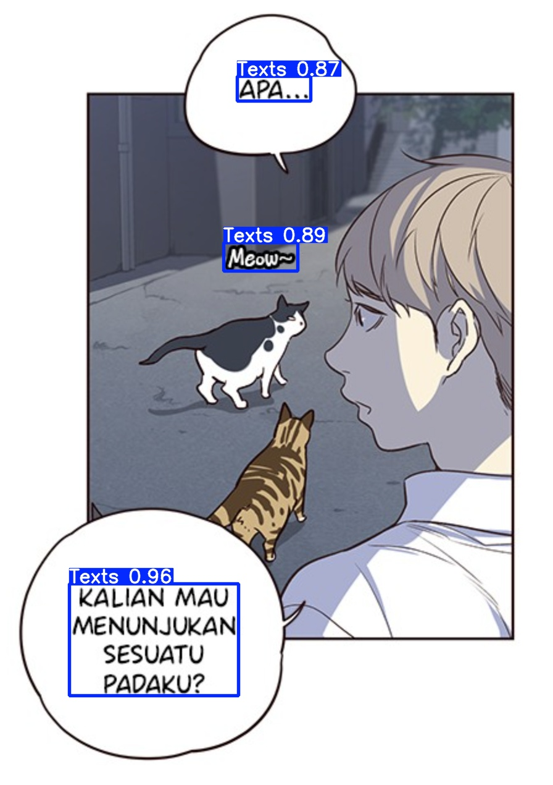
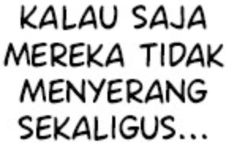
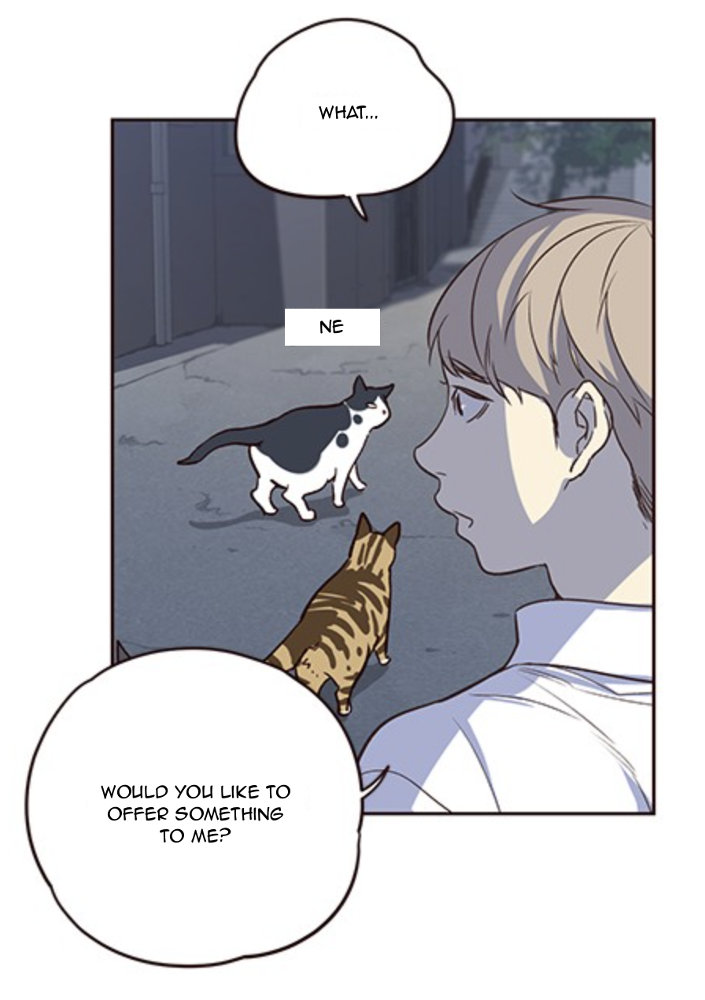

[](https://paperswithcode.com/sota/object-detection-on-4?p=crossing-language-borders-a-pipeline-for)

[](https://paperswithcode.com/sota/machine-translation-on-opensubtitles?p=crossing-language-borders-a-pipeline-for)

## Crossing Language Borders: A Pipeline for Indonesian Manhwa Translation done in collaboration with Sagarika Singh (ss3038@rit.edu)
([Paper Link](https://arxiv.org/abs/2501.01629))

This project presents a practical and efficient pipeline to automate the **translation of Manhwa (Korean comics) from Indonesian to English**, using a combination of computer vision, OCR, and machine translation.

This repo contains the final pipeline code and results from each stage. Due to limitations, we have not uploaded the training models' weights and other parameters. You are welcome to reach out to me if you need the weights of the fine-tuned YOLO model and fine-tuned translation model. 


---

## Abstract

Manhwa is gaining popularity globally, but language remains a barrier. Manual translation from Indonesian to English is slow and labor-intensive. Our pipeline leverages machine learning to automate:

- **Speech bubble detection** (YOLOv5xu)
- **Optical Character Recognition (OCR)** (Tesseract)
- **Machine Translation** (fine-tuned MarianMT)
- **Text reintegration** onto original panels (OpenCV, Pillow)

This solution reduces turnaround time and enhances accessibility for English-speaking audiences, especially given the low-resource nature of the Indonesian-English translation domain.

---

## Datasets

| Component               | Dataset Source         | Description                                                |
|------------------------|------------------------|------------------------------------------------------------|
| Speech Bubble Detection| Webcomics (Roboflow)   | 538 annotated Manhwa panels with "Text" class             |
| Machine Translation    | Identic + OpenSubtitles| ~30,000 bilingual lines covering formal and informal text  |

---

## Methodology

| Step                  | Model/Tool Used         | Description                                                |
|-----------------------|-------------------------|------------------------------------------------------------|
| 1. Bubble Detection   | YOLOv5xu (fine-tuned)   | Detects speech bubbles in panels                           |
| 2. OCR                | Tesseract (Indonesian)  | Extracts text from bubbles (CER: 3.1%)                     |
| 3. Translation        | MarianMT (fine-tuned)   | Translates Indonesian text to English (BLEU: 0.27, METEOR: 0.61) |
| 4. Reintegration      | OpenCV, Pillow          | Renders translated text in the original speech bubbles     |

---

## Results

| Component               | Metric              | Score    |
|-------------------------|---------------------|----------|
| **YOLOv5xu (Detection)**| F1 Score            | 90.7%    |
|                         | mAP@0.5             | 96.3%    |
|                         | Mean Precision      | 89.4%    |
| **OCR (Tesseract)**     | Character Error Rate| 3.1%     |
|                         | Word Error Rate     | 8.6%     |
| **Translation (MarianMT)**| BLEU              | 0.27     |
|                         | METEOR              | 0.61     |

The pipeline shows **strong performance** across detection, transcription, and translation—despite limited data—highlighting the effectiveness of targeted fine-tuning for low-resource tasks.

---

## 📌 Sample Output

| Step                   | Sample                           |
|------------------------|----------------------------------|
| Original Panel         |         |
| Detected Speech bubbles Bubbles extracted     |          |
| Translated Panel       |       |


---

### Required Libraries
The following libraries and tools are required. Ensure they are installed before running the notebook:
- `tesseract-ocr`
- `pytesseract`
- `opencv-python`
- `ultralytics`
- `sacremoses`
- Hugging Face Transformers library (`transformers`)

Use the following commands to install missing dependencies in Colab:
```bash
!apt-get install -y tesseract-ocr tesseract-ocr-ind
!pip install pytesseract opencv-python ultralytics sacremoses
```
---

## File Path locations
Please note that there are many files used in the code, please change the file path location accordingly. 

1. trained_model_path = ".../NLP_pro/yolo_training/manhwa_yolo_training_res2/weights/best.pt" : This contains the path to our fine-tuned Yolov5xu best.pt model for detecing speech bubbles. 
2. test_images_dir = ".../NLP_pro/manhwa_test_2" : This contains 11 images for running the model on. 
3. output_images_dir = ".../NLP_pro/manhwa_test_results/predictions" : Images with bounding boxes will be saved here. 
4. output_crops_dir = ".../NLP_pro/manhwa_test_results/speech_bubble_crops" : Extracted speech bubbles will be saved here. 
5. bbox_output_dir = ".../NLP_pro/manhwa_test_results/test_bbox" : Extracted bounding box dimensions will be saved here. 
6. ocr_results_dir = ".../NLP_pro/manhwa_test_results/speech_bubble_ocr_results" : OCR results will be saved here (json).
7. translations_dir = ".../NLP_pro/manhwa_test_results/speech_bubble_translations" : Translations will be saved here (json).
8. translated_images_dir = ".../NLP_pro/manhwa_test_results/translated_images" : Final translated images will be saved here. 
9. translation_model_path = ".../NLP_pro/final_trans_model" : This contains the path to the fine-tuned MarianMT model for best.pt model to use for translation. 

---

## Pipeline Steps
### 1. Object Detection
The YOLOv5 model detects the speech bubbles in the images and generatesthe bounding boxes.
- Detected bounding boxes are saved as JSON files.

### 2. OCR
Tesseract OCR extracts the text from the detected bounding boxes.
- Outputs are saved as JSON files.

### 3. Translation
The extracted text is then translated using the pre-trained translation model.
- Outputs are saved as JSON files.

### 4. Overlay Translations
The translated text is rendered back onto the original images while also using the original font.
- Final images with translations are saved.

---

## Input and Output
### Input
- Test images should be stored in the directory specified by `test_images_dir` (e.g., `/content/drive/MyDrive/NLP_pro/manhwa_test_2`).

### Output
- Processed images with bounding boxes and translations are saved in:
  - `output_images_dir`: Images with bounding boxes.
  - `translated_images_dir`: Images with translated text.
- Intermediate outputs:
  - `output_crops_dir`: Cropped speech bubbles.
  - `ocr_results_dir`: OCR results.
  - `translations_dir`: Translations in JSON format.
 
---

## Acknowledgement 
This work was developed and co-authored as part of the Natural Language Processing course (PSYC 681) at Rochester Institute of Technology.

---

